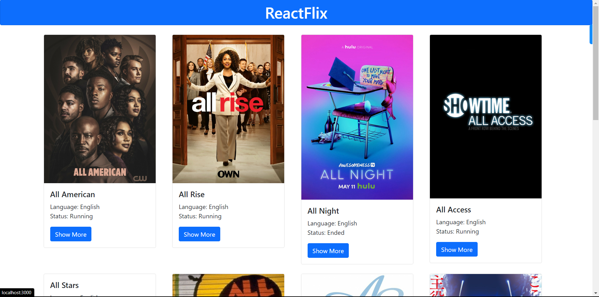
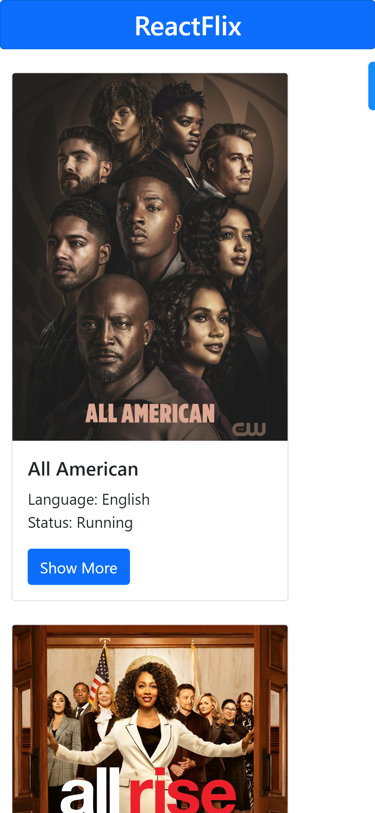
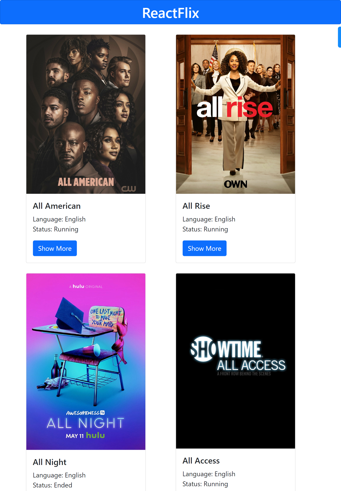

# Internship Assignment Task - ReactFlix

```
Task: Make ReactFlix React App

We would like you to create a 2 screen React JS application using this
API: https://api.tvmaze.com/search/shows?q=all
Please visit this API endpoint to understand the structure of the response.

We need you to create a basic UI to display the show names and a few details about it (you can choose what you want to display along with the show name). Include a button for each of the shows to redirect the user to another screen that shows the summary of the particular show. (Refer to the api structure. You will find a summary section for each show there.). We need you to complete this assignment and upload it to a GitHub Repository marked as Public and email us back the link to the repository (check the contact section for the email address).


Please note:
It has to be a React JS application.
It has to implement the API and not just hardcode data from the API.
It has to have 2 screens at a minimum. One to display a few data and possibly an image(UI is completely up to you) and another screen to show it’s summary.
The second screen should have a button to book a movie ticket which will open a form with the movie name already present and a few relevant details.
(Reload should not happen)
(Use local/session storage for storing user details)
A proper UI so that we know you have a good understanding of UI/UX. Doesn’t need to have mind blowing animations but just basic HTML and CSS styling that looks good (You may use bootstrap).

```

## Screenshots

[Video Recording](https://www.awesomescreenshot.com/video/17169597?key=737e470f1c412cbd8a248c3b3a45e430)







## Installation

Use the package manager [npm](https://www.npmjs.com/) to install the dependencies.

```bash
npm install
```

## Usage

```bash
npm start
```

Live: [ReactFlix]()
